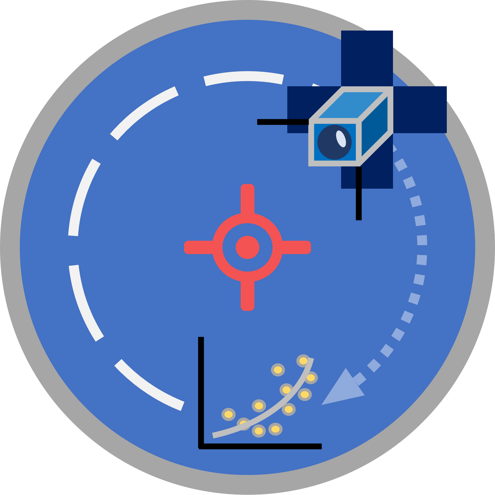

# SatRelMDPC 
## [Satellite Relative Trajectory - Model Discovery and Predictive Control]

SatRelMDPC is a graduate thesis project in space engineering, focusing on satellite relative trajectory bounding controller design.
SatRelMDPC aims to control a follower satellite around close proximity of a chief satellite to guarantee the relative range bounds are respected. 

* Non-linear control
* **MPC** (Model based Predictive Controller)
* [Sparse Identification of Nonlinear Dynamics]

[Sparse Identification of Nonlinear Dynamics]: https://github.com/dynamicslab/pysindy

## Pre-requisites
(Dependencies under Anaconda are recommended to be installed from within Anaconda navigator --> Environments) 
* [Matlab & Simulink](https://www.mathworks.com/products/matlab.html)
* [Python3](https://www.python.org/downloads/)
* [Anaconda](https://www.anaconda.com/)
  * [PySindy](https://github.com/dynamicslab/pysindy)
  * [Pandas](https://pandas.pydata.org/)
  * [Numpy](https://numpy.org/install/)
  * [Matplotlib](https://matplotlib.org/)

## How It Works

## Usage

## Contributions
Contributions are what make the open source community such an amazing place to learn, inspire, and create. Any contributions you make are **greatly appreciated**.

If you have a suggestion that would make this better, please fork the repo and create a pull request. You can also simply open an issue with the tag "enhancement". Don't forget to give the project a star! Thanks again!

(Replace "AmazingFeature" with your feature name)

1) Fork the Project
2) Create your Feature Branch (git checkout -b feature/AmazingFeature)
3) Commit your Changes (git commit -m 'Add some AmazingFeature')
4) Push to the Branch (git push origin feature/AmazingFeature)
5) Open a Pull Request

**Contributors:**
It's just me for now....
* [Hariharan Vitaladevuni](https://github.com/hvhariharan)

## Acknowledgements

## License
GNU GENERAL PUBLIC LICENSE
Version 3, 29 June 2007

Copyright (C) 2007 Free Software Foundation, Inc. <https://fsf.org/>

Everyone is permitted to copy and distribute verbatim copies
of this license document, but changing it is not allowed.

## Contact
Hariharan Vitaladevuni [Email](mailto:h.v.hariharan@gmail.com)

Project Link [SatRelMDPC](https://github.com/hvhariharan/SatRelMDPC)
